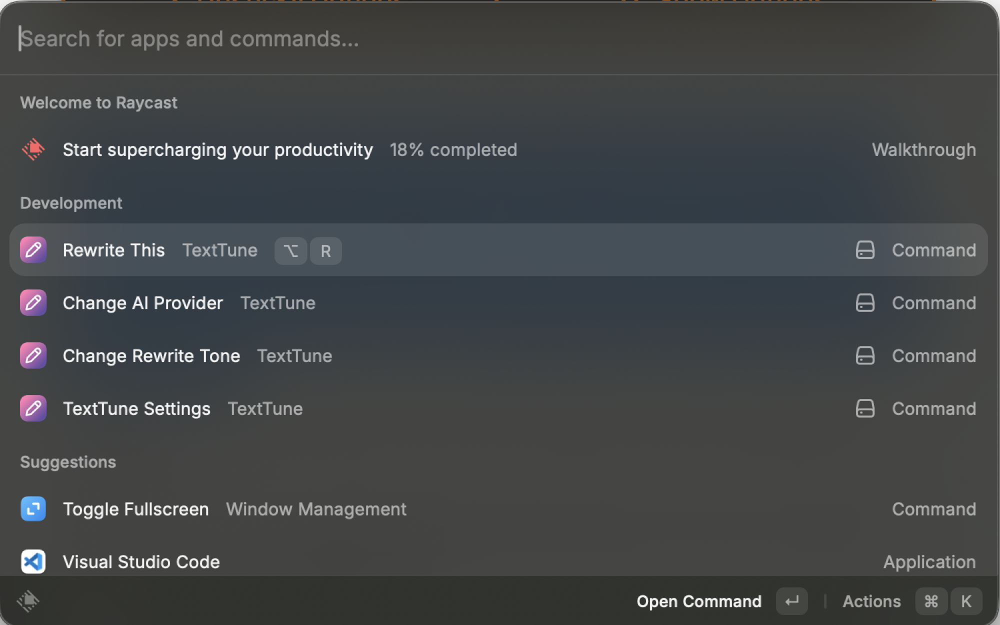

# TextTune

Instantly rewrite selected text using AI, right from Raycast. Works across all macOS apps — Slack, Gmail, editors, Linear, and more.

## How It Works

1. Select any text in any app
2. Press your assigned hotkey (e.g., `⌥⇧R`)
3. TextTune rewrites the text using AI
4. Press **Enter** to paste it back, or **⌘⇧C** to copy

## Commands

| Command | What it does |
|---------|-------------|
| **Rewrite This** | Rewrite selected text with AI. Press Enter to paste back. |
| **Change Rewrite Tone** | Switch between Professional, Casual, Fix Grammar, Concise, Friendly, Formal |
| **Change AI Provider** | Switch between OpenAI, Claude, and Groq |
| **TextTune Settings** | Open all settings |

## Setup

1. Install the extension from the [Raycast Store](https://www.raycast.com/deepak_singh/texttune)
2. Open Raycast and search **"TextTune Settings"**
3. Choose your AI provider and enter your API key
4. Assign a hotkey to **"Rewrite This"** in Raycast Preferences → Extensions → TextTune

## Supported Providers

| Provider | API Key | Default Model | Notes |
|----------|---------|---------------|-------|
| **OpenAI** | Required | `gpt-4o-mini` | |
| **Anthropic** | Required | `claude-sonnet-4-20250514` | |
| **Groq** | Required (free) | `llama-3.3-70b-versatile` | Free tier at [groq.com](https://groq.com) |

## Rewrite Tones

- **Professional** — Clear workplace communication
- **Casual** — Conversational and relaxed
- **Fix Grammar** — Corrects errors, preserves your voice
- **Concise** — Removes fluff, keeps substance
- **Friendly** — Warm and approachable
- **Formal** — Polished business language

## Privacy & Security

- **API keys are stored in macOS Keychain** via Raycast's encrypted password preferences — never in any project file
- **No API keys, tokens, or secrets exist in this repository**
- Selected text is sent only to your configured AI provider over HTTPS
- No text is logged, cached, or sent anywhere else
- API keys are redacted from error messages
- Text payload is capped at ~20,000 characters to prevent accidental large requests

## Contributing

1. Clone the repo
2. Run `npm install && npm run dev`
3. Make changes — Raycast hot-reloads automatically

## License

MIT
